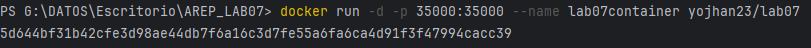
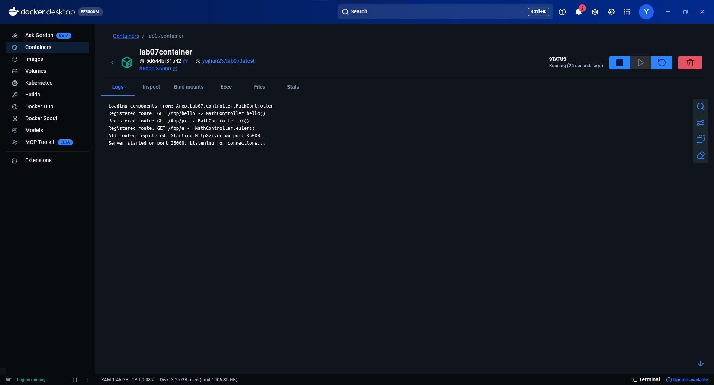
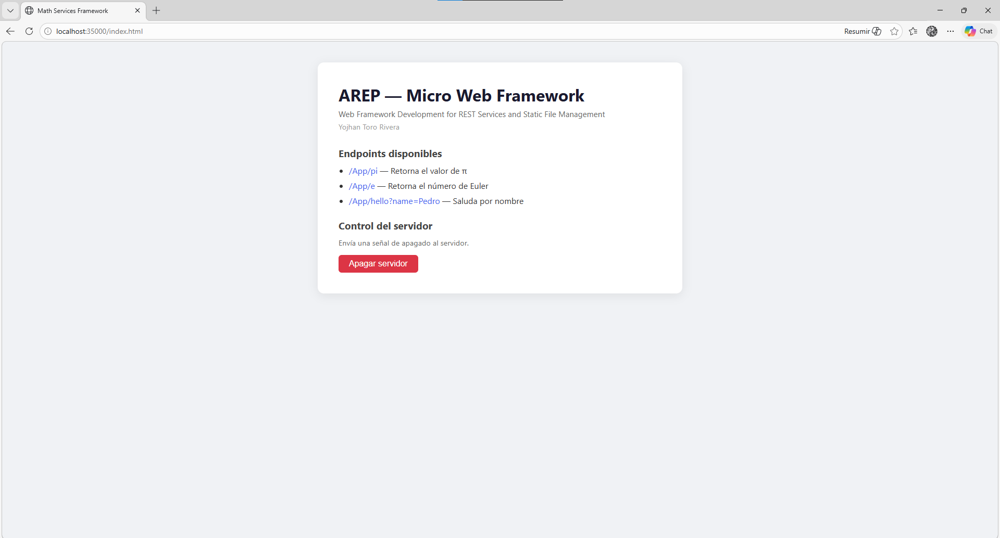
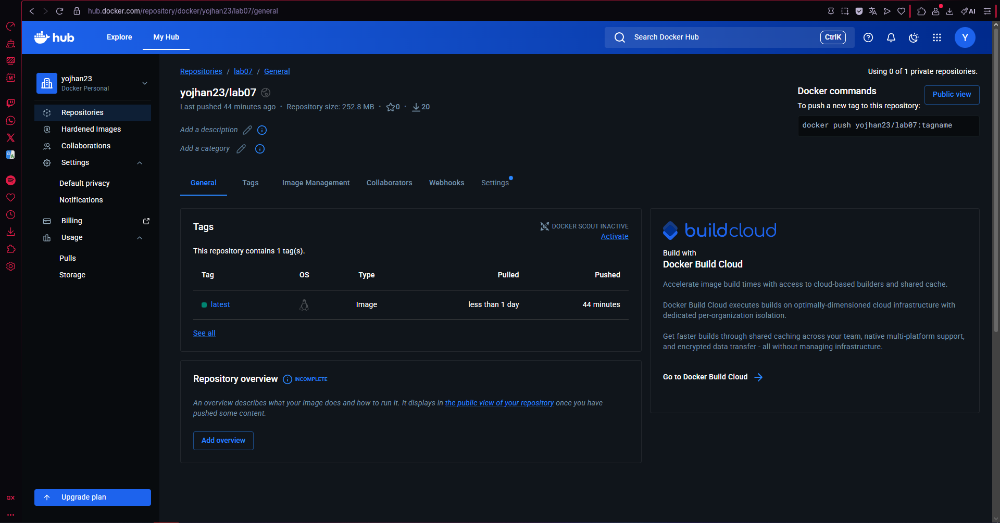
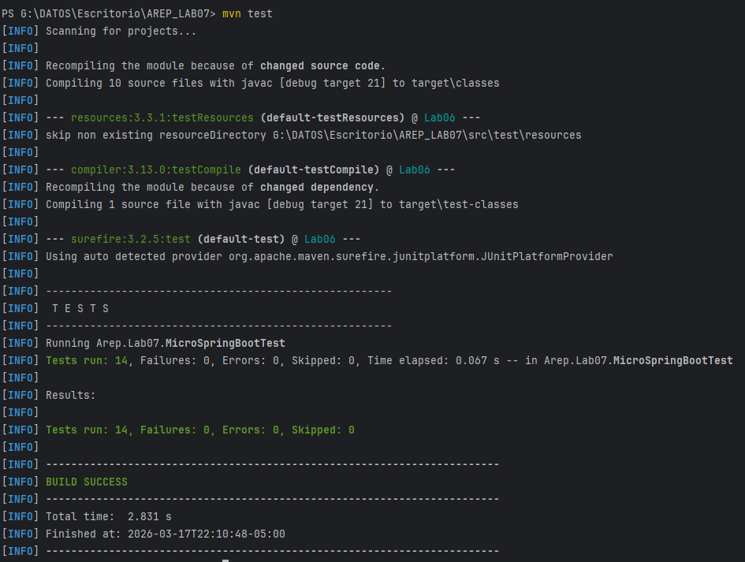

# AREP Lab07 — Micro Web Framework con Docker y AWS

Framework web propio en Java (sin Spring) que soporta solicitudes concurrentes, apagado elegante, y despliegue en contenedores Docker sobre AWS EC2.

## Tabla de contenidos
- [Descripción](#descripción)
- [Arquitectura](#arquitectura)
- [Prerrequisitos](#prerrequisitos)
- [Instalación y ejecución local](#instalación-y-ejecución-local)
- [Ejecución con Docker](#ejecución-con-docker)
- [Subir imagen a DockerHub](#subir-imagen-a-dockerhub)
- [Despliegue en AWS EC2](#despliegue-en-aws-ec2)
- [Pruebas](#pruebas)
- [Construido con](#construido-con)
- [Autor](#autor)

---

## Descripción

Este proyecto implementa un micro-framework web en Java puro que imita las anotaciones de Spring (`@RestController`, `@GetMapping`, `@RequestParam`) usando reflexión. El framework fue mejorado para:

- **Manejar solicitudes concurrentes** mediante un `ExecutorService` con un pool de 10 hilos.
- **Apagarse de manera elegante** usando un `Runtime.addShutdownHook` registrado en un hilo separado, que espera hasta 30 segundos para que los hilos activos terminen antes de cerrar el servidor.
- **Servir archivos estáticos** (HTML, CSS, JS, imágenes) desde la carpeta `webroot/public`.
- **Desplegarse en Docker** y ejecutarse en una instancia EC2 de AWS.

---

## Arquitectura

El sistema sigue una arquitectura cliente-servidor de una sola capa:

```
Cliente (Browser)
       │
       │ HTTP GET :35000
       ▼
┌─────────────────────────────────────┐
│           HttpServer                │
│  ServerSocket (puerto 35000)        │
│  ExecutorService (10 hilos)         │
│  ┌──────────────────────────────┐   │
│  │       ClientHandler          │   │  ← Un hilo por conexión
│  │  Lee request → busca ruta    │   │
│  │  → ejecuta WebMethod         │   │
│  │  → responde HTTP             │   │
│  └──────────────────────────────┘   │
│  Runtime ShutdownHook               │  ← Se activa con Ctrl+C o /shutdown
└─────────────────────────────────────┘
       │
       ▼
┌─────────────────────────────────────┐
│         MicroSpringBoot             │
│  Reflexión sobre @RestController    │
│  Registra rutas @GetMapping         │
└─────────────────────────────────────┘
       │
       ▼
┌─────────────────────────────────────┐
│         MathController              │
│  @GetMapping /App/hello             │
│  @GetMapping /App/pi                │
│  @GetMapping /App/e                 │
└─────────────────────────────────────┘
```

El servidor corre dentro de un contenedor Docker desplegado en una instancia EC2 de AWS. La imagen Docker se almacena en DockerHub y se descarga directamente en la EC2.

```
DockerHub (yojhan23/lab07)
       │
       │ docker pull
       ▼
┌─────────────────────┐
│   AWS EC2 Instance  │
│   Docker Container  │
│   Puerto 35000      │
└─────────────────────┘
       │
       │ HTTP :35000
       ▼
    Browser
```

---

## Prerrequisitos

- Java 21 o superior
- Maven 3.8+
- Docker Desktop (para contenedores locales)
- Cuenta en [DockerHub](https://hub.docker.com)
- Cuenta en AWS (para el despliegue en EC2)

---

## Instalación y ejecución local

**1. Clonar el repositorio:**
```bash
git clone https://github.com/Yojhan-Toro/AREP_LAB07.git
cd AREP_LAB07
```

**2. Compilar el proyecto:**
```bash
mvn clean package
```

**3. Ejecutar:**
```bash
# En Linux/Mac
java -cp "target/classes:target/dependency/*" Arep.Lab07.Application

# En Windows (CMD)
java -cp "target/classes;target/dependency/*" Arep.Lab07.Application
```

**4. Acceder en el browser:**
```
http://localhost:35000/index.html
```

**5. Endpoints disponibles:**

| Endpoint | Descripción | Ejemplo |
|----------|-------------|---------|
| `GET /App/hello?name={nombre}` | Saluda por nombre | `/App/hello?name=Pedro` → `Hello Pedro!` |
| `GET /App/pi` | Retorna el valor de π | `PI = 3.141592653589793` |
| `GET /App/e` | Retorna el número de Euler | `e = 2.718281828459045` |
| `GET /shutdown` | Apaga el servidor elegantemente | Activa el ShutdownHook |

---

## Ejecución con Docker

**1. Construir la imagen:**
```bash
docker build --tag lab07 .
```

**2. Correr el contenedor:**
```bash
docker run -d -p 35000:35000 --name lab07container lab07
```

**3. Verificar que está corriendo:**
```bash
docker ps
```

**4. Acceder:**
```
http://localhost:35000/index.html
```

**5. Detener el contenedor:**
```bash
docker stop lab07container
```

**6. Reiniciar el contenedor:**
```bash
docker start lab07container
```

### Evidencia — Ejecución local con Docker








---

## Subir imagen a DockerHub

```bash
# Crear referencia con el nombre del repositorio
docker tag lab07 yojhan23/lab07

# Iniciar sesión en DockerHub
docker login

# Subir la imagen
docker push yojhan23/lab07:latest
```

### Evidencia — DockerHub

> 
> *Imagen publicada en el repositorio yojhan23/lab07*

---

## Despliegue en AWS EC2

**1. Conectarse a la instancia EC2.**

**2. Instalar Docker:**
```bash
sudo yum update -y
sudo yum install docker -y
```

**3. Iniciar el servicio Docker:**
```bash
sudo service docker start
```

**4. Agregar el usuario al grupo docker:**
```bash
sudo usermod -a -G docker ec2-user
```

**5. Desconectarse y volver a conectarse** para que el cambio de grupo tenga efecto.

**6. Descargar y correr la imagen desde DockerHub:**
```bash
docker run -d -p 35000:35000 --name lab07container yojhan23/lab07
```

**7. Abrir el puerto 35000** en el Security Group de la instancia EC2 desde la consola de AWS.

**8. Acceder desde el browser:**
```
http://<public-dns-ec2>:35000/index.html
```

### Evidencia — AWS EC2

https://youtu.be/pT3MURvQnXU 

---

## Pruebas

### Correr las pruebas automatizadas

```bash
mvn test
```

### Descripción de las pruebas

Las pruebas se encuentran en `src/test/java/Arep/Lab07/MicroSpringBootTest.java` y cubren:

**Pruebas de `HttpRequest`:**
- Parseo correcto de query params desde la URL
- Retorno de string vacío para parámetros inexistentes
- Soporte para múltiples parámetros en la query string
- Extracción correcta del path sin los query params

**Pruebas de `MathController`:**
- `/App/hello` retorna el saludo con el nombre correcto
- `/App/hello` usa `"World"` como valor por defecto
- `/App/pi` retorna el valor correcto de `Math.PI`
- `/App/e` retorna el valor correcto de `Math.E`

**Pruebas de anotaciones (reflexión):**
- `MathController` tiene la anotación `@RestController`
- El método `hello` tiene `@GetMapping("/App/hello")`
- El parámetro de `hello` tiene `@RequestParam(value="name", defaultValue="World")`
- Existen al menos 3 rutas `@GetMapping` registradas

**Pruebas de `HttpResponse`:**
- El código de estado por defecto es `200`
- El `Content-Type` se puede cambiar correctamente

### Ejemplo de salida de pruebas exitosa

```
[INFO] Tests run: 13, Failures: 0, Errors: 0, Skipped: 0
[INFO] BUILD SUCCESS
```

### Evidencia — Pruebas




---

## Construido con

- **Java 21** — Lenguaje de programación
- **Maven** — Gestión de dependencias y construcción
- **JUnit 5** — Pruebas automatizadas
- **Docker** — Contenedorización
- **AWS EC2** — Despliegue en la nube

---

## Autor

**Yojhan Toro Rivera**
- GitHub: [@Yojhan-Toro](https://github.com/Yojhan-Toro)
- DockerHub: [yojhan23](https://hub.docker.com/u/yojhan23)